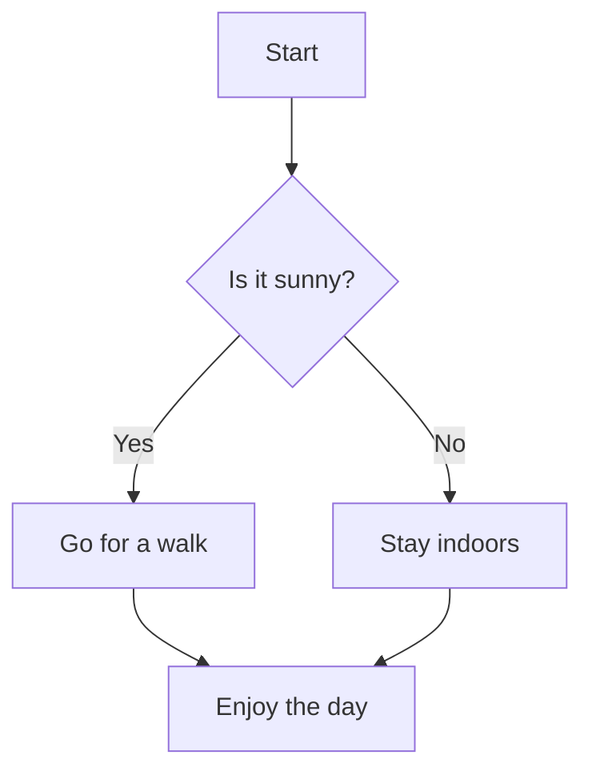
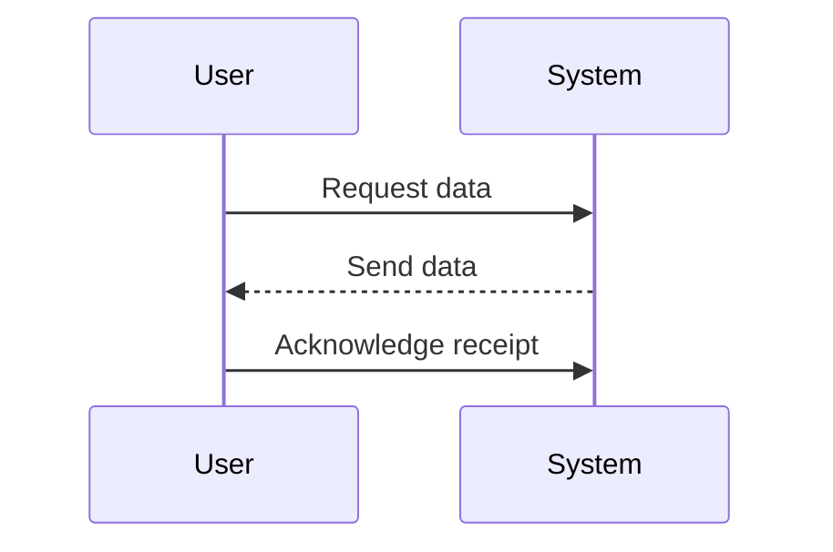

# Diagram Example

## Flowchart

```mermaid
flowchart TD
    A[Start] --> B{Is it sunny?}
    B -- Yes --> C[Go for a walk]
    B -- No --> D[Stay indoors]
    C --> E[Enjoy the day]
    D --> E
```

## Sequence Diagram

```mermaid
sequenceDiagram
    participant User
    participant System
    User->>System: Request data
    System-->>User: Send data
    User->>System: Acknowledge receipt
```
